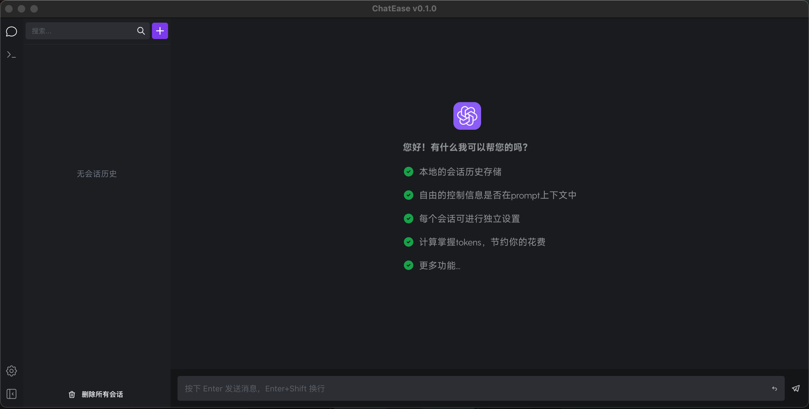
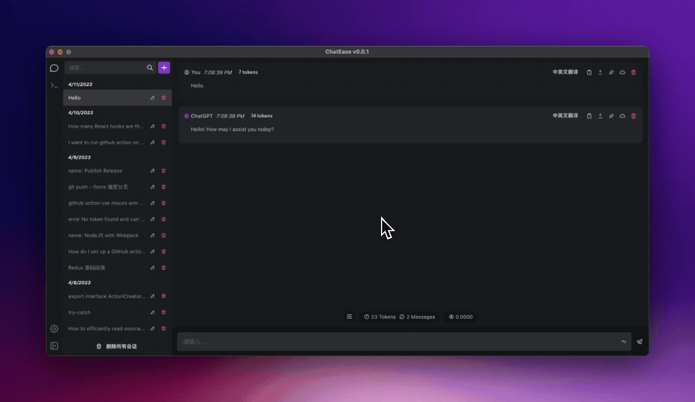

# ChatEase

<p align="center">
    <a href="./README.md">English</a> | <b>中文</b>
</p>

>帮助你更好的管理与ChatGPT的对话

## 使用前

1. OpenAI API Key

2. 好的网络环境（能够自己保证不被封号）

## 下载和安装

[Release Page](https://github.com/gyuannn/ChatEase/releases/)

MacOS 打开显示文件损坏，使用命令行执行;


```
xattr -d com.apple.quarantine /Applications/ChatEase.app 
```

## 一点小知识

### 什么是prompt？什么是tokens？他们如何影响你与GPT的对话？

**什么是prompt？**

与ChatGPT的每一句对话，都可以称作为prompt，并在每次回答时作为ChatGPT下次回答的上下文。你的每一次新提问，都会将你跟GPT的历史对话一起发给GPT来进行回答。但对prompt的长度有着限制，tokens是prompt的长度计算单位。

**什么是tokens？**

tokens是ChatGPT模型对上下文长度的计算方法，在GPT-3.5中，对tokens的数量限制为4096，即如果你的上下文为4000个tokens，GPT最多只能回复96个tokens。

[OpenAI官方对tokens的说明文档](https://help.openai.com/en/articles/4936856-what-are-tokens-and-how-to-count-them)

## 基础功能

1. 与GPT对话，代码显示

2. Prompt Library（beta）

3. 会话历史存储和搜索（本地）

4. 对话分享

5. `tokens` 计算和花销统计 / en-zh / 暗黑模式 / 反代设置 / HTTP代理 / 字体大小调整 等其他基础功能

6. 数据的导入和导出

## 进阶功能

### 每个会话的独立设置

每一个会话设置都是持久化的，你可以具体选择：

* 设置会话在prompt中的消息数量限制

* 设置会话在prompt中的tokens数量限制

* 设置会话的temperature

* 设置会话使用的模型


### 搜索信息内容


### 控制对话是否在 prompt 之中

在默认情况下，该状态根据对话的先后顺序和设置限制自动进行计算，你也可以手动进行控制，将对话添加至  `prompt` 或从 `prompt` 中移除


### 将消息固定在prompt中


### 配合prompt action来与GPT对话（翻译 / 纠正提问语法 / 优化提问）


### 更多对话菜单功能



## Roadmap

- [ ] 更好的对话体验（最终目的是让整个对话结构更为清晰，方便自动整理成笔记）

- [ ] GPT4支持，目前还在 `waitlist` 中

- [ ] 满意的 Prompt Library 模块

- [ ] 满意的 UI/UX

## 贡献

本仓库是个人学习和实践的平台，仓库的代码质量在写 `README` 时，可能不在一个很高的水平（屎山），内部可能有很多不合理的设计，但会在后续的开发中，不断的重构以达到开源的要求，如果你想贡献代码，请酌情考虑。
