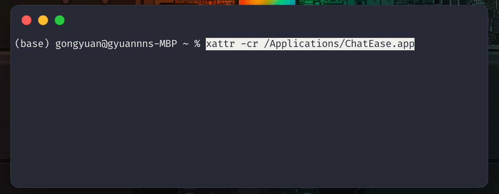

# Install

## MacOS

1. Download file from release page. (从release页面下载对应架构的.zip文件)

2. Unzip .zip file and drap .app file to Applications folder.（解压后移动到Application文件夹下）

3. Open your terminal, and run command（打开terminal运行指令）

    ```
    xattr -cr /Applications/ChatEase.app
    ```

    
